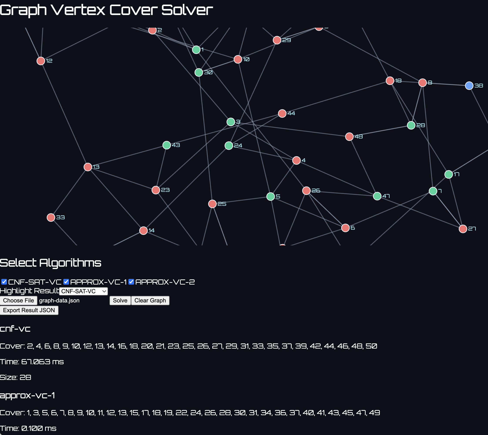

# 🧠 Graph Vertex Cover Solver

A full-stack graph optimization platform for solving the **Minimum Vertex Cover** problem using exact and approximation algorithms. Includes a real-time interactive UI for graph construction, algorithm comparison, and result visualization.



---

## 📦 Project Structure

```
.
├── backend/                # FastAPI backend
│   ├── main.py             # Entry point
│   ├── database.py         # PostgreSQL caching logic
│   ├── solver_runner.py    # C++ solver integration
│   ├── models.py           # Pydantic models
│   └── cache.py            # Cache query helpers
├── build/                  # Compiled C++ solvers
├── external/               # External assets (optional)
├── frontend/               # React + Tailwind frontend
│   ├── src/                # App logic
│   └── node_modules/       # Dependencies (excluded)
├── approx1.cpp            # APPROX-VC-1 implementation
├── approx2.cpp            # APPROX-VC-2 implementation
├── cnf-sat-vc.cpp         # CNF-SAT-VC exact solver
├── vertex_cover_main.cpp  # C++ multithreaded dispatcher
├── CMakeLists.txt         # C++ build system
├── README.md              # Project documentation
```

---

## 🚀 Features

- ✅ Exact solver using CNF-SAT-VC (SAT-based)
- ✅ Two approximation algorithms (APPROX-VC-1 and APPROX-VC-2)
- ✅ Real-time graph drawing and edge editing
- ✅ WebSocket-based solve interaction with backend
- ✅ PostgreSQL cache for repeated queries
- ✅ D3.js visualization + Tailwind styling
- ✅ Export results as JSON

---

## ⚙️ Technology Stack

| Layer        | Tech                          |
| ------------ | ----------------------------- |
| Frontend     | React, Vite, Tailwind CSS, D3 |
| Backend      | FastAPI, WebSockets, SQLAlchemy |
| Database     | PostgreSQL                    |
| Solver Core  | C++ multithreaded + SAT       |
| Build Tools  | CMake, Docker (optional)      |

---

## 🧪 Algorithms Implemented

| Name         | Language | Type         |
| ------------ | -------- | ------------ |
| CNF-SAT-VC   | C++      | Exact Solver |
| APPROX-VC-1  | C++      | Greedy       |
| APPROX-VC-2  | C++      | Edge-Pairing |

Each solver writes its result to `stdout` and is executed from Python using `subprocess`.

---

## 🧰 Setup Instructions

### 1. Backend

```bash
cd backend
python -m venv .venv
source .venv/bin/activate
pip install -r requirements.txt
uvicorn main:app --reload
```

### 2. Frontend

```bash
cd frontend
npm install
npm run dev
```

Then open: [http://localhost:5173](http://localhost:5173)

### 3. C++ Build

```bash
mkdir -p build && cd build
cmake ..
make
```

The compiled `solver` will be used by FastAPI to solve the vertex cover.

---

## 🐳 Docker (Optional)

```bash
docker compose up --build
```

---

## 📁 Dataset Format

Use `graphs.txt` for bulk testing. JSON upload is also supported:

```json
{
  "vertices": [1, 2, 3],
  "edges": [[1, 2], [2, 3]]
}
```

---

## 📄 License

This project is for educational/research purposes.

---

## 🧠 Author

Developed by Aries Chen as an extension of a University of Waterloo course project.
